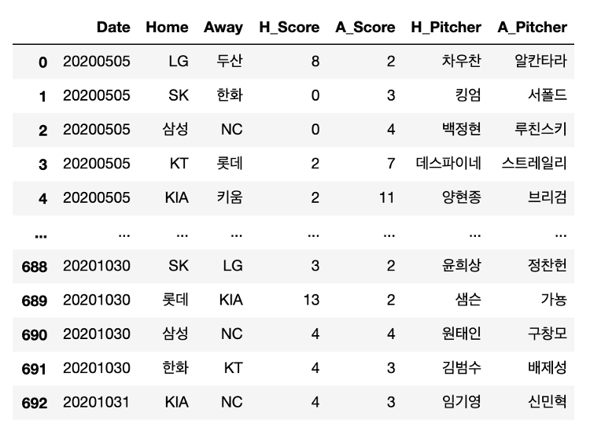

# Bayesian Regression을 이용한 야구 경기 결과 예측

 

## 주제 선정 이유

(1) 베이지안 기법은 스포츠 데이터에 적합

- 이적, 부상으로 인한 교체 등의 변화를 데이터가 적은 상태에서도 사전분포의 활용으로 기대 반영이 가능하다.

- 업데이트를 통한 트렌드 반영이 가능하다.

(2) 야구는 통계와 적합한 팀 스포츠

-  투수와 타자의 1대1 상황을 가정할 수 있어 외부요인 개입의 요소가 적다.

- 데이터가 다른 스포츠에 비해 비교적 명확하다.

- 시즌 당 경기 수가 많고, 스코어도 많이 나기 때문에 분석에 용이하다.

 

---------------

## 데이터 수집 

[KBO 공식 홈페이지](https://www.koreabaseball.com/Schedule/Schedule.aspx) 에서 2020 시즌 KBO 전체 경기에 대한 정보를 크롤링.

- 경기일자
- 홈팀 / 원정팀
- 홈팀 스코어 / 원정팀 스코어

- 홈팀 선발투수 / 원정팀 선발투수

{: width="500" height="300"}

 

---------------

## 모델링

- 프로야구 10개 팀 각각의 공격력/수비력 모수 추정

$$
Score \sim Poisson(\theta) \\
\; \\
\theta = (\beta_1 + att_1 + def_1) \; \gamma \\
\; \\
\beta_1  \sim Flat \\
att_1 \sim N(0, \sigma_{att}) \\
def_1 \sim N(0, \sigma_{def}) \\
\; \\
\sigma_{att} \sim HalfStudentT(3,2) \\
\sigma_{def} \sim HalfStudentT(3,2) \\
\; \\
\gamma = scaling\;factor
$$

 

---

# 결과 

 

**<경기결과 시뮬레이션>**

---------------

## 발전 방향

- 베이지안 모델의 유용성/확장성을 적극 이용
- 창의적으로 새로운 변수를 추가해서 모델을 정교화

